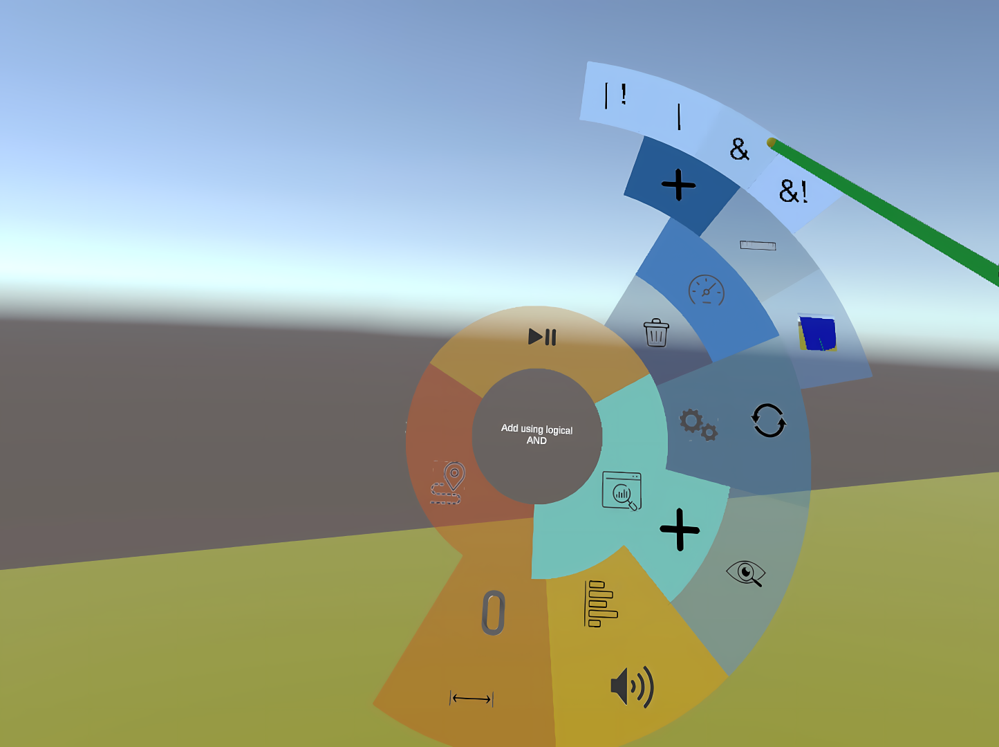

# Immersive Study Analyzer: Collaborative Immersive Analysis of Recorded Social VR Studies

This is the open-source Unity implementation of the Immersive Study Analyzer (ISA) system which enables recording of social VR studies and subsequent collaborative analysis in virtual reality (VR).
Recorded participant behaviour can be collaboratively coded (annotated) and interactively analyzed using analysis queries.
To support phases of loose and tightly coupled collaboration analysts can independently navigate in playback time.
Visualisations and techniques such as the time portal support collaboration between users located at different temporal positions.
The plugin for recording, playback and analysis is made open source [here](https://github.com/vrsys/Recording-And-Analysis-Plugin).
For further information we refer to our paper (linked below).

To enable multi-user VR interactions our system builds on the [Photon](https://www.photonengine.com/pun) version of the Open-Source [vrsys-core](https://github.com/vrsys/vrsys-core) project.
For the visualisation of outlines the [QuickOutline](https://github.com/chrisnolet/QuickOutline) implementation of Chris Nolet is used.
The radial slider (used by the radial menu) is part of the [Unity UI Extension project](https://github.com/jesenzhang/unity-ui-extensions).

Setup:
========================
1. Setup and start the [ISA server](https://github.com/vrsys/Immersive-Study-Analyzer-Server)
   - For this, please follow the README of the repository.


2. Setup of the Photon Unity Network (PUN) credentials 
   - Open the PUN Wizard e.g. by selecting "Window/Photon Unity Networking/PUN Wizard".
   - Click "Locate PhotonServerSettings".
   - Enter your own App Id PUN and App Id Voice credentials.


3. Specify the ISA server ip in the recorder state component 
   - Navigate to the prefabs used for analysis located under "Assets/VRSYS/Recording/Resources/UserPrefabs/".
   - Each prefab contains a recording setup object that has components such as the RecorderState for managing recording, replay and analysis.
   - Locate the RecorderState and enter the ip of the ISA server in the server list.
   - This step is important for storing and retrieving annotations for subsequent analysis sessions and for storing and distributing recordings.


4. Configure input actions for recording and playback 
   - Each user prefab also contains an InputController component on the gameobject with the RecorderState component.
   - The InputController controls which inputs are used to create and replay recordings on desktop and HMD devices.
   - New [input actions](https://docs.unity3d.com/Packages/com.unity.inputsystem@1.0/manual/Actions.html) can be setup and used to replace existing ones.


5. Open and start the example scene 
   - Open the example scene located at "Assets/VRSYS/Recording/Scenes/SimpleNetworkScene.unity".
   - Press play in the editor.
   - During the first start, performance might be slow for a couple of seconds as the radial menu gets generated.


6. Create or join a lobby 
    - Specify your username, color, the device type (BaseAnalysisHMD or AdvancedAnalysisHMD) and the room you want to join/create.


7. Create a recording 
   - To create a recording the input actions specified in the InputController can be used (by default the "R" key on the keyboard starts/stops the creation of recordings).
   - The RecorderState will display the current state (Idle, Recording, Replaying, ...).
   - The "Recording File" property displays the name of the recording that will be created.
   


8. Get familiar with the controls


9. Select and start a replay
   - In the advanced analysis mode the radial menu can be activated using the left controller primary button (see help menu).
   - The radial menu can be used to select a recording file that is stored on the ISA server for playback.
   - Playback automatically starts for every analyst in the same lobby.


10. Using analysis functionalities
   - The time portal can be activated using the secondary right controller button (see help menu).
   - To activate the timeline and annotation UI the left controller grip button can be pressed (see help menu).
   - Using trajectory previews:
     - Select the trajectory icon in the inner ring of the radial menu (orange).
     - Specify the object by selecting the object icon and subsequently selecting the object in the scene.
     - Specify the start and end time for which the trajectory is requested using the radial slider.
     - Select the plus button to confirm the parameter choices and visualise the trajectory.
     - Trajectory previews can be deleted using the trash icon.
      
   - Using analysis queries:
     - Select the analysis icon in the inner ring of the radial menu (turquoise).
     - Specify the id of the compound query which you want to create/extend (orange).
     - Select the plus icon to add a query to the specified compound query (turquoise).
     - Select the query you want to add.
     
     - Specify query parameters (using the radial slider and the object selection).
     - Add a query to the specified compound query by selecting the + button next to the parameter specification and specify how it should be added to the compound query.
     
     - Select the gear icon (light blue) to process all compound queries (results are visualised as annotations on the timeline).
     
     - In the image above, the annotations corresponds to the following queries: red = velocity(a)>t, orange = velocity(b)<t, yellow = velocity(a)>t | velocity(b) > t
     - The trash can (dark blue) can be used to delete all compound queries as well as their results.
   
<!---
## BibTeX Citation

If you use the ISA system or the recording and analysis plugin of the ISA system in a scientific publication, we would appreciate using the following citations:

```
@article{Lammert2024,
    doi       = {XXXX/XXXX},
    url       = {https://doi.org/XXXX/XXXX},
    year      = {2024},
    publisher = {IEEE Computer Society},
    author    = {Anton Lammert, Gareth Rendle, Felix Immohr, Annika Neidhardt, Karlheinz Brandenburg, Alexander Raake, and Bernd Froehlich},
    title     = {Immersive Study Analyzer: Collaborative Immersive Analysis of Recorded Social VR Studies},
}
```
-->
